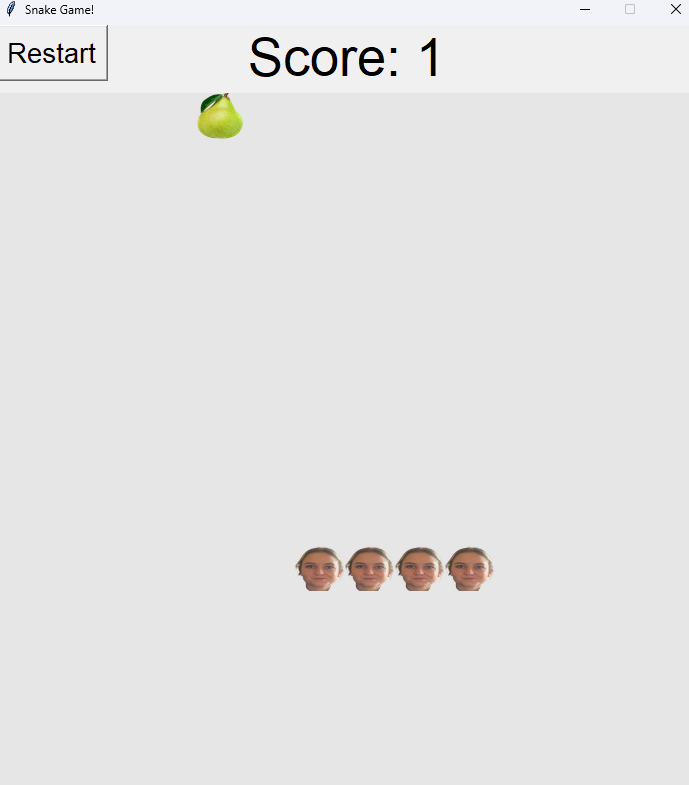
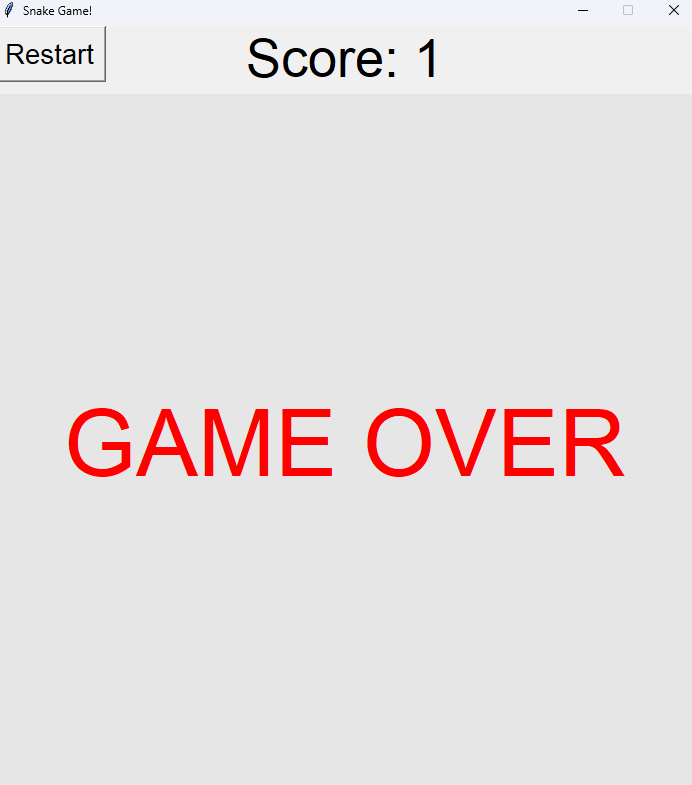

# 🐛 Olivia Caterpillar Game


**Snake-style game** built with Python and Tkinter (*one of the very first Python projects I ever made*)

---

## 🖼️ Screenshots

*Gameplay*  


*Game Over*  


---

## ✨ Features

- **🐍 Classic Snake Gameplay**: Grow longer by collecting food
- **🖼️ Image-Based Sprites**: Custom snake and food images
- **🔁 Restart Button**: Instantly reset and try again
- **🎮 Keyboard Controls**: Smooth arrow-key movement

---

## 📋 Requirements

- Python 3.x
---

## 🚀 Installation

1. Clone or download this repository  
2. Install dependencies:

```bash
pip install -r requirements.txt
```

3. Run the game:

```bash
python snake.py
```

---

## 🎯 How to Play

1. The game starts immediately
2. Use the arrow keys to move the caterpillar
3. Eat the food to grow longer and increase your score
4. Avoid:
   - The edges of the screen
   - Running into yourself
5. Click **Restart** to begin again after a game over

---

## 🎮 Controls

- **⬆️ Up Arrow**: Move up  
- **⬇️ Down Arrow**: Move down  
- **⬅️ Left Arrow**: Move left  
- **➡️ Right Arrow**: Move right  
- **🖱️ Restart Button**: Reset the game  

---

## 📝 Notes

- This is quite a funny application, I'm pretty sure it was one of the first "*things*" I ever built with Python. As such, I'm not really going to touch this at all. If I was ever going to do this again, I'd probably use PyGame instead of Tkinter. Still though, lots of fun!

---

## 👏 Credits

Created by **Russell Chubb**
